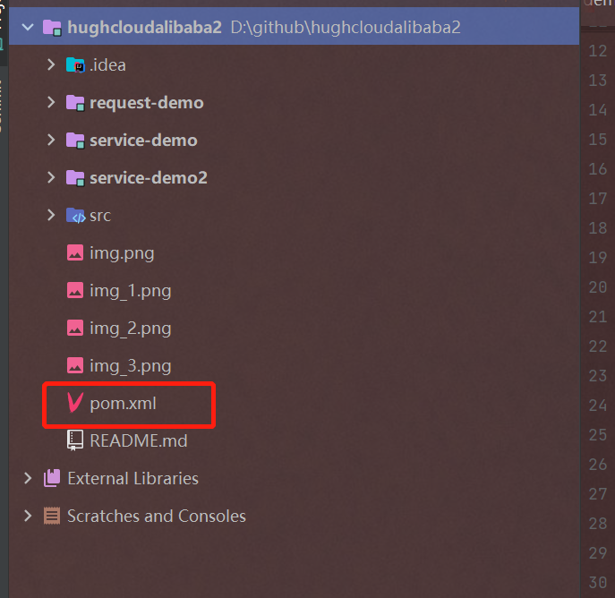

## 主要讲解
主要模拟 服务通信基础


## 学习过程  

这里是模拟 调用 但是 比较简单的本模块自调用

- 创建一个 `HelloServiceImpl` 作为被调用方

- 创建一个 `controller` 进行调用

- 运行项目 浏览器输入 Ip:port/hello 进行查看

过于基础 不做过多讲解


### 进阶
将 刚刚创建的数据复制到 demo 2 中 进行接下来的演习操作

1、运行demo2 保证模块是正常运行的


2、再创建一个模块

创建一个名称为request-demo的Spring Boot实例项目，端口号设置为8090。然后在pom.xml文件中添加httpclient的依赖配置，代码如下：
```xml
<dependency>
  <groupId>org.apache.httpcomponents</groupId>
  <artifactId>httpclient</artifactId>
</dependency>
```
将 `request-demo` 添加到 父 pom 之中 不然不能识别为子模块



3、 在`request-demo` 下创建 `controller` 创建 `ConsumerController`

进行代码编写

```java


import org.apache.http.client.methods.CloseableHttpResponse;
import org.apache.http.client.methods.HttpGet;
import org.apache.http.impl.client.CloseableHttpClient;
import org.apache.http.impl.client.HttpClients;
import org.apache.http.util.EntityUtils;
import org.springframework.web.bind.annotation.GetMapping;
import org.springframework.web.bind.annotation.RestController;

import java.io.IOException;

@RestController
public class ConsumerController {

    private final String SERVICE_URL = "http://localhost:8088";
    //private final String SERVICE_URL = "http://localhost:8082";

    /**
     * 使用HttpClient来处理http请求
     * @return
     * @throws IOException
     */
    @GetMapping("/httpClientTest")
    public String httpClientTest() throws IOException {
        CloseableHttpClient httpClient = HttpClients.createDefault();
        HttpGet httpGet = new HttpGet(SERVICE_URL + "/hello");
        CloseableHttpResponse response = null;
        try {
            // 执行请求
            response = httpClient.execute(httpGet);
            // 判断返回状态码
            if (response.getStatusLine().getStatusCode() == 200) {
                String content = EntityUtils.toString(response.getEntity(), "UTF-8");
                // 返回
                return content;
            }
        } finally {
            if (response != null) {
                response.close();
            }
            httpClient.close();
        }
        return "请求成功";
    }
}
```

**`详细解读`**

 - import org.apache.http.client.methods.CloseableHttpResponse; 导入CloseableHttpResponse类，该类表示可关闭的HTTP响应。
- import org.apache.http.client.methods.HttpGet; 导入HttpGet类，该类用于发送HTTP GET请求。
- import org.apache.http.impl.client.CloseableHttpClient; 导入CloseableHttpClient类，该类表示可关闭的HTTP客户端。
- import org.apache.http.impl.client.HttpClients; 导入HttpClients类，该类提供了用于创建HTTP客户端的工厂方法。
- import org.apache.http.util.EntityUtils; 导入EntityUtils类，该类提供了用于从响应体中获取内容的方法。
- import org.springframework.web.bind.annotation.GetMapping; 导入GetMapping注解，该注解用于将HTTP GET请求映射到特定的处理方法。
- import org.springframework.web.bind.annotation.RestController; 导入RestController注解，该注解表示这是一个控制器类，并且其中的所有方法都是以RESTful风格编写的。
- @RestController注解表示这是一个控制器类，并且其中的所有方法都是以RESTful风格编写的。

- @GetMapping("/httpClientTest")注解将HTTP GET请求映射到httpClientTest()方法。

- CloseableHttpClient httpClient = HttpClients.createDefault();创建一个默认的HTTP客户端。

- HttpGet httpGet = new HttpGet(SERVICE_URL + "/hello");创建一个HTTP GET请求，请求的URL为SERVICE_URL + "/hello"。

- response = httpClient.execute(httpGet);执行请求
- String content = EntityUtils.toString(response.getEntity(), "UTF-8");
- 使用EntityUtils类的toString()方法将响应体转换为字符串，编码方式为UTF-8。
- response.close();关闭响应。 
- httpClient.close();关闭HTTP客户端。

### 启动三个实例

访问 `http://localhost:8087/httpClientTest`   

执行结果 

## 使用RestTemplate处理请求 

在 `request-demo` 创建 一个 config 包  名称为 `RestTemplateConfig` 代码如下
### RestTemplate 介绍
RestTemplate是Spring框架提供的用于发送HTTP请求的工具类，它使用了模板模式，提供了大量的HTTP方法，如GET、POST、PUT、DELETE等，可以用于处理各种HTTP请求。

**`下面是一些常用的RestTemplate方法：`**

1、getForObject(String url, Class<T> responseType)：发送HTTP GET请求，并将响应体转换为指定类型的对象。

2、postForObject(String url, Object request, Class<T> responseType)：发送HTTP POST请求，并将响应体转换为指定类型的对象。

3、put(String url, Object request)：发送HTTP PUT请求。

4、delete(String url)：发送HTTP DELETE请求。

**`除了上述方法，RestTemplate还提供了下面几个方法，用于处理HTTP响应：`**

1、getForEntity(String url, Class<T> responseType)：发送HTTP GET请求，并将响应体转换为指定类型的对象，同时返回响应头信息。

2、postForEntity(String url, Object request, Class<T> responseType)：发送HTTP POST请求，并将响应体转换为指定类型的对象，同时返回响应头信息。

3、exchange(String url, HttpMethod method, HttpEntity<?> requestEntity, Class<T> responseType)：发送HTTP请求，
请求方法、请求头、请求体可以自定义，并将响应体转换为指定类型的对象，同时返回响应头信息

4、exchange(String url, HttpMethod method, HttpEntity<?> requestEntity, ParameterizedTypeReference<T> responseType)：
发送HTTP请求，请求方法、请求头、请求体可以自定义，并将响应体转换为指定类型的对象，同时返回响应头信息。

5、exchange(String url, HttpMethod method, HttpEntity<?> requestEntity, Class<T> responseType)：
发送HTTP请求，请求方法、请求头、请求体可以自定义，并将响应体转换为指定类型的对象，同时返回响应头信息。

6、exchange(String url, HttpMethod method, HttpEntity<?> requestEntity, ParameterizedTypeReference<T> responseType)：发送HTTP请求，请求方法、请求头、
请求体可以自定义，并将响应体转换为指定类型的对象，同时返回响应头信息。

**`需要注意，RestTemplate默认使用SimpleClientHttpRequestFactory实例创建HTTP请求，如果需要自定义HTTP请求工厂，可以使用以下构造方法：`**

- RestTemplate(ClientHttpRequestFactory requestFactory)
- RestTemplate()
如果使用无参构造方法，需要使用setRequestFactory()方法设置HTTP请求工厂。

**`另外，RestTemplate还支持自定义HTTP消息转换器，使用方法如下`**：

```java
RestTemplate restTemplate = new RestTemplate();
restTemplate.getMessageConverters().add(new MappingJackson2HttpMessageConverter());
```
这样就可以使用RestTemplate发送JSON格式的HTTP请求和响应。

### 代码
```java
import org.springframework.context.annotation.Bean;
import org.springframework.context.annotation.Configuration;
import org.springframework.http.client.ClientHttpRequestFactory;
import org.springframework.http.client.SimpleClientHttpRequestFactory;
import org.springframework.web.client.RestTemplate;
import org.springframework.http.converter.StringHttpMessageConverter;

import java.nio.charset.Charset;

@Configuration
public class RestTemplateConfig {

    @Bean
    public RestTemplate restTemplate(ClientHttpRequestFactory factory) {
        RestTemplate restTemplate = new RestTemplate(factory);
        // UTF-8编码设置
        restTemplate.getMessageConverters().set(1,
                new StringHttpMessageConverter(Charset.forName("UTF-8")));
        return restTemplate;

    }

    @Bean
    public ClientHttpRequestFactory simpleClientHttpRequestFactory() {
        SimpleClientHttpRequestFactory factory = new SimpleClientHttpRequestFactory();
        // 超时时间 10秒
        factory.setReadTimeout(10 * 1000);
        // 超时时间 5秒
        factory.setConnectTimeout(5 * 1000);
        return factory;
    }
}

```
然后在ConsumerController类中引入RestTemplate对象，并使用它来发起请求和处理请求回调结果。代码如下：

```java

@RestController
@AllArgsConstructor
public class ConsumerController {

    private RestTemplate restTemplate;
    private final String SERVICE_URL = "http://localhost:8088";
    //private final String SERVICE_URL = "http://localhost:8082";

    /**
     * 使用RestTemplate来处理http请求
     * @return
     */
    @GetMapping("/restTemplateTest")
    public String restTemplateTest() {
        // 打印请求结果
        return restTemplate.getForObject(SERVICE_URL + "/hello", String.class);
    }
}


```
访问截图

### 上述代码解释
上述代码是一个Spring Boot配置类，用于配置RestTemplate类，它用于发送HTTP请求。

- @Configuration注解表示这是一个配置类。
- @Bean注解表示在Spring容器中生成一个Bean，该方法的返回值作为Bean。
- RestTemplateConfig类中有两个方法：

- restTemplate()方法创建一个RestTemplate实例，并设置消息转换器的字符集为UTF-8。
- simpleClientHttpRequestFactory()方法创建一个SimpleClientHttpRequestFactory实例，该实例用于创建RestTemplate实例，并设置连接超时时间和读取超时时间。
- import java.nio.charset.Charset;导入Charset类，该类用于表示字符集。
- @Configuration注解表示这是一个配置类。

- @Bean注解表示在Spring容器中生成一个Bean，该方法的返回值作为Bean。

- RestTemplate restTemplate = new RestTemplate(factory);创建一个RestTemplate实例，该实例使用传入的factory参数创建HTTP请求。

- restTemplate.getMessageConverters().set(1, new StringHttpMessageConverter(Charset.forName("UTF-8")));设置消息转换器的字符集为UTF-8。

- return restTemplate;返回RestTemplate实例。

- SimpleClientHttpRequestFactory factory = new SimpleClientHttpRequestFactory();创建一个SimpleClientHttpRequestFactory实例，该实例用于创建RestTemplate实例。

- factory.setReadTimeout(10 * 1000);设置读取超时时间为10秒。

- factory.setConnectTimeout(5 * 1000);设置连接超时时间为5秒。

- return factory;返回SimpleClientHttpRequestFactory实例。
- 
## 使用WebClient处理请求
### WebClient  讲解和使用技巧
WebClient是Spring 5中新添加的Web框架，它是基于Reactor构建的非阻塞HTTP客户端。WebClient支持发送各种HTTP请求，如GET、POST、PUT、DELETE等，并且可以处理HTTP响应。

WebClient的使用方法如下：

1、创建WebClient实例：
WebClient webClient = WebClient.create("http://localhost:8080");
2、发送HTTP请求：

```java
webClient
.method(HttpMethod.GET) // 请求方法
.uri("/path") // 请求路径
.retrieve() // 获取响应结果
.bodyToMono(String.class) // 将响应结果转换为指定类型的对象
```
3、处理HTTP响应：
将响应结果转换为指定类型的对象：
`.bodyToMono(String.class)`

4、将响应结果转换为Flux，即一个发布者：

`.bodyToFlux(String.class)`

5、将响应结果转换为ResponseEntity，即一个包含响应体、响应头和响应状态码的对象：
`.toEntity(String.class)`

6、注册订阅者：
```java
.subscribe(result -> { // 处理响应结果
    System.out.println(result);
});
```

在实际使用中，你可以通过链式调用的方式来构建HTTP请求，例如：
```java

webClient
    .method(HttpMethod.POST)
    .uri("/path")
    .body(BodyInserters.fromObject("request body"))
    .header("Authorization", "Bearer xxx")
    .retrieve()
    .bodyToMono(String.class)
    .subscribe(result -> {
        System.out.println(result);
    });
```
这段代码构建了一个POST请求，并在请求头中添加了Authorization头信息，并将响应结果转换为String类型的对象。

需要注意的是，在调用subscribe()方法之前，HTTP请求并不会真正发送，直到调用subscribe()方法才会真正发送HTTP请求。

另外，WebClient还支持发送异步请求，例如：
```java
webClient
    .method(HttpMethod.GET)
    .uri("/path")
    .retrieve()
    .bodyToMono(String.class)
```
### 代码
WebClient是从Spring WebFlux 5.0版本开始提供的一个非阻塞的基于响应式编程的进行HTTP请求的客户端工具，它的响应式编程的基于Reactor的
。与RestTemplate工具类似，都是Spring官方提供的HTTP请求工具，方便开发者们进行网络编程。

只是二者有些许不同， RestTemplate是阻塞式客户端，WebClient是非阻塞客户端，而且二者所依赖的Servlet环境不同，
WebClient是Spring WebFlux开发库的一部分，引入starter场景启动器时使用的依赖如下：

```xml
<dependency>
  <groupId>org.springframework.boot</groupId>
  <artifactId>spring-boot-starter-webflux</artifactId>
</dependency>
```

创建 controller  `WebfluxController` 写入 如下代码

```java
package ltd.newbee.cloud.controller;

import lombok.AllArgsConstructor;
import org.springframework.web.bind.annotation.RestController;
import org.springframework.web.bind.annotation.GetMapping;
import org.springframework.web.reactive.function.client.WebClient;
import reactor.core.publisher.Mono;

@RestController
public class WebfluxController {

    private final String SERVICE_URL = "http://localhost:8088";
    //private final String SERVICE_URL = "http://localhost:8082";

    private WebClient webClient = WebClient.builder()
            .baseUrl(SERVICE_URL)
            .build();

    /**
     * 使用WebClient处理http请求
     * @return
     */
    @GetMapping("/webClientTest")
    public String webClientTest() {
        Mono<String> mono = webClient
                // GET 请求方式
                .get() 
                // 路径
                .uri("/hello")
                // 获取响应结果
                .retrieve() // 获取响应结果
                //响应结果转换
                .bodyToMono(String.class); 

        // 打印请求结果
        mono.subscribe(result -> {
            System.out.println(result);
        });
        return "请求成功";
    }
}

```
运行项目 访问 成功截图


### 上述代码解释

- `import reactor.core.publisher.Mono`;导入Mono类，该类是一个发布者，用于在异步场景中发布一个或多个事件。
@RestController注解表示这是一个RESTful控制器，它会将方法的返回值自动转换为JSON格式。

- `@AllArgsConstructor`注解表示生成一个包含所有参数的构造方法。

- `WebClient webClient = WebClient.builder() .baseUrl(SERVICE_URL) .build()`;创建一个WebClient实例，该实例使用指定的基地址和默认设置创建HTTP请求。

- `.get().uri("/hello").retrieve().bodyToMono(String.class)`;发送HTTP GET请求，并将响应体转换为String类型的对象。

- `mono.subscribe(result -> { System.out.println(result); })`;注册订阅者，在收到响应结果时，输出请求结果。

- return "请求成功";返回请求成功的消息。